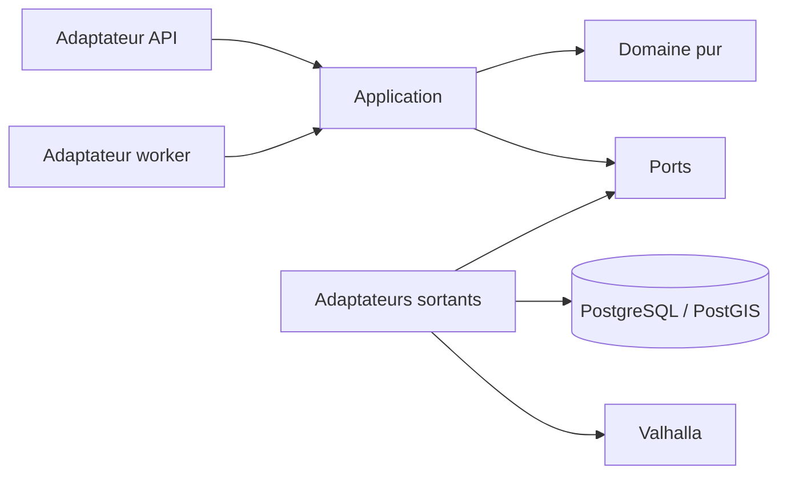
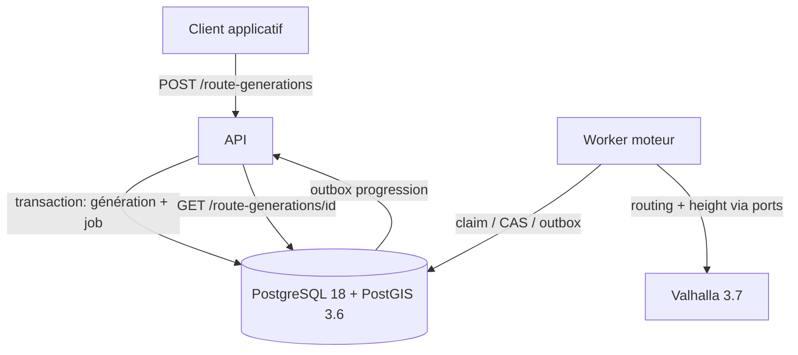
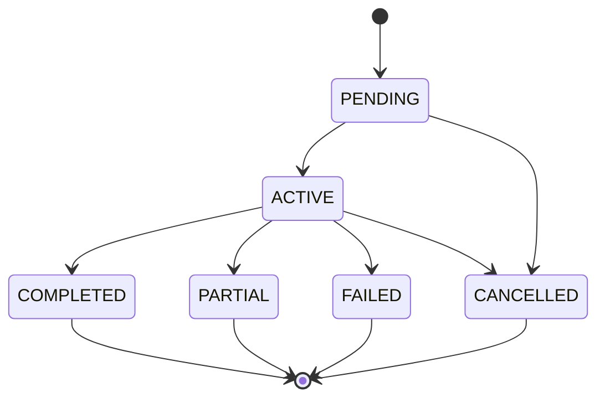

# Architecture Spine — Moteur de génération de parcours vélo V1

## Design Paradigm

Architecture hexagonale autour d'un pipeline déterministe. Le domaine pur définit les politiques et calculs; l'application orchestre les cas d'usage; les ports décrivent les dépendances externes; les adaptateurs portent HTTP, PostgreSQL/PostGIS et Valhalla.



## Invariants & Rules

### AD-1 — Cœur indépendant des technologies

- **Binds:** CAP-1 à CAP-7
- **Prevents:** une logique normative différente selon l'API, le worker, la base ou le fournisseur.
- **Rule:** le domaine et ses tests n'importent ni FastAPI, ni ORM, ni client Valhalla; les adaptateurs dépendent des ports et du noyau, jamais l'inverse.

### AD-2 — Pipeline normatif à portes irréversibles [ADOPTED]

- **Binds:** CAP-1 à CAP-5
- **Prevents:** le scoring ou la sélection d'un candidat qui viole une contrainte dure.
- **Rule:** tout candidat suit `normaliser → planifier → router → enrichir → valider → mesurer/évaluer → optimiser → diversifier → sélectionner/expliquer`; toute mutation produit une nouvelle révision, invalide les artefacts antérieurs et la réinjecte avant `router`; seuls les artefacts calculés sur l'empreinte exacte d'une géométrie entièrement validée peuvent être sélectionnés.

### AD-3 — PostgreSQL/PostGIS propriétaire de l'état durable [ADOPTED]

- **Binds:** CAP-3 à CAP-7
- **Prevents:** des générations, géométries, diagnostics ou versions contradictoires entre processus.
- **Rule:** générations, candidats, géométries SRID 4326, bundles de politiques, diagnostics et transitions sont persistés dans PostgreSQL/PostGIS; aucun cache ou fournisseur n'est une source de vérité métier.

### AD-4 — File transactionnelle PostgreSQL [ASSUMPTION]

- **Binds:** CAP-6, CAP-7
- **Prevents:** double exécution et ajout prématuré d'un broker à la V1 auto-hébergée.
- **Rule:** l'API crée la génération et son job dans une transaction; chaque claim atomique produit un `leaseEpoch` monotone; toute écriture ou prolongation de bail exige l'epoch courant et une identité idempotente `generationId/attempt/candidate`; une reprise conserve génération, seed et deadline mais rend l'ancien worker incapable d'écrire.

### AD-5 — Terminalité atomique [ADOPTED]

- **Binds:** CAP-6, CAP-7
- **Prevents:** qu'une annulation, un timeout ou un résultat tardif remplace un état terminal.
- **Rule:** une transition compare-and-set autorise exactement un passage de non-terminal vers `COMPLETED|PARTIAL|FAILED|CANCELLED`; toute écriture de candidat ou progression échoue si l'état est déjà terminal.

### AD-6 — Deadline propagée [ADOPTED]

- **Binds:** CAP-6
- **Prevents:** un calcul ou appel fournisseur actif après 60 secondes.
- **Rule:** le commit d'acceptation fixe `acceptedAt` et `hardDeadlineAt` UTC immuables; chaque processus en dérive un budget monotone local sans jamais le réinitialiser; le franchissement de 15 s est persisté/publié une fois; tout appel reçoit un timeout borné et toute réponse après 60 s est rejetée, même si le fournisseur distant continue son calcul.

### AD-7 — Politiques immuables par génération [ADOPTED]

- **Binds:** CAP-3 à CAP-5
- **Prevents:** des résultats non reproductibles mélangeant plusieurs classifications, paramètres ou algorithmes.
- **Rule:** au démarrage, la requête normalisée référence un bundle immuable contenant versions normatives, politique de retries/backoff et digests des tuiles OSM, du costing et des données d'altitude; aucune configuration relue ensuite ne modifie la génération en cours.

### AD-8 — Fournisseurs remplaçables et non normatifs [ADOPTED]

- **Binds:** CAP-1 à CAP-5
- **Prevents:** la captivité fournisseur et la délégation des décisions métier au routeur.
- **Rule:** `RoutingProvider` et `ElevationProvider` sont des ports distincts; leurs contrats versionnés fixent points demandés/snapés, stops/anchors ordonnés, géométrie/segmentation, provenance, unités/arrondis et erreurs métier/transitoires/définitives; l'adaptateur initial est Valhalla, mais validation, métriques normatives, score, similarité et explications restent dans le domaine.

### AD-9 — Mutations par commandes, diffusion après commit

- **Binds:** CAP-2, CAP-6, CAP-7
- **Prevents:** progression visible avant persistance et concurrence incohérente entre génération, annulation et réévaluation.
- **Rule:** mutation métier, progression correspondante et événement outbox forment une transaction; livraison au-moins-une-fois avec `eventId` stable et séquence monotone par génération; consommateurs idempotents; progression coalesçable mais terminalité jamais; les lectures utilisent des projections sans muter le domaine.

### AD-10 — Audit reproductible et minimisation des journaux [ADOPTED]

- **Binds:** CAP-3 à CAP-7
- **Prevents:** une décision impossible à expliquer ou une fuite de données géographiques dans les logs.
- **Rule:** chaque exécution conserve seed, requêtes, versions, fournisseur, résultats, rejets agrégés et durées; les logs structurés portent les identifiants et versions mais excluent coordonnées brutes et payloads complets par défaut.

### AD-11 — Unités et identifiants canoniques

- **Binds:** CAP-1 à CAP-7
- **Prevents:** divergences de calcul ou sérialisation entre modules.
- **Rule:** UUIDv7 pour les nouveaux identifiants externes, UTC ISO-8601 pour les instants, mètres pour distances/altitudes, secondes pour durées, degrés pour angles et SRID 4326 pour les géométries; conversion uniquement aux frontières.

### AD-12 — Topologie de déploiement V1 [ASSUMPTION]

- **Binds:** CAP-1 à CAP-7
- **Prevents:** des environnements non représentatifs ou une dépendance propriétaire cachée.
- **Rule:** Docker Compose lance quatre rôles — API, worker, PostgreSQL/PostGIS et Valhalla — avec images épinglées par digest et dépendances lockées; un migrateur unique précède les writers et le boot vérifie versions serveur, extension et schéma; seuls configuration, secrets et volumes varient entre environnements.

### AD-13 — Identité, propriété et historique utilisateur [ADOPTED]

- **Binds:** CAP-1, CAP-4, CAP-5, CAP-6
- **Prevents:** usurpation du `userId`, fuite inter-comptes et score de nouveauté dépendant d'un historique mouvant.
- **Rule:** l'identité vient du principal authentifié, jamais du payload; création, lecture, annulation et historique sont autorisés côté serveur par propriétaire; `HistoryPort` fournit un snapshot figé et identifié par génération, excluant la génération courante de la nouveauté.

### AD-14 — Erreurs et tentatives fournisseur déterministes

- **Binds:** CAP-3, CAP-6, CAP-7
- **Prevents:** des statuts `PARTIAL`/`FAILED` différents selon l'adaptateur ou l'ordre des timeouts.
- **Rule:** le bundle fixe taxonomie d'erreurs, nombre de retries, backoff déterministe, budget minimal et effet sur candidat ou génération; tentative d'appel et tentative de job sont distinctes et auditées; aucune tentative ne dépasse la deadline.

### AD-15 — Cycle de vie des géodonnées

- **Binds:** CAP-1 à CAP-7
- **Prevents:** accès excessif ou suppression partielle de requêtes et géométries sensibles.
- **Rule:** les géodonnées sont classifiées, accessibles au moindre privilège et chiffrées par le socle; purge et suppression couvrent atomiquement génération, candidats, géométries et événements associés; les durées de rétention sont fixées avant mise en service.

## Consistency Conventions

| Concern | Convention |
| --- | --- |
| Nommage | Types métier au singulier; commandes à l'impératif; événements au passé; ports suffixés `Port`, adaptateurs suffixés par technologie. |
| Contrats | DTO d'entrée/sortie versionnés; enums inconnus rejetés; erreurs applicatives sous forme `code`, `message`, `details`, `correlationId`. |
| État | Seul le dépôt de génération effectue les compare-and-set; aucun adaptateur ne modifie directement une entité. |
| Déterminisme | Tri total explicite pour tout classement; seed persisté; horloge, UUID et fournisseurs injectés. |
| Configuration | Paramètres normatifs dans des bundles versionnés; secrets et paramètres opérationnels par variables d'environnement. |
| Observabilité | Logs JSON et métriques corrélés par `generationId`/`correlationId`; cardinalité bornée sur les labels. |
| Tests | Tests de domaine sans infrastructure; contrats pour chaque port; intégration PostGIS/Valhalla; corpus normatif en non-régression. |

## Stack

| Name | Version |
| --- | --- |
| Python | 3.14.7 |
| FastAPI | 0.141.1 |
| PostgreSQL | 18.4 |
| PostGIS | 3.6.4 |
| Valhalla | 3.8.3 |
| Docker Compose | Specification courante, sans champ `version` |

## Structural Seed

```text
route_engine/
  domain/          # politiques, entités, calculs et pipeline purs
  application/     # commandes, requêtes, orchestration et ports
  adapters/
    inbound/       # API HTTP et worker
    outbound/      # PostgreSQL/PostGIS, Valhalla, horloge, événements
  bootstrap/       # composition et configuration opérationnelle
tests/
  unit/            # domaine/application sans infrastructure
  contract/        # conformité de chaque adaptateur aux ports
  integration/     # PostgreSQL/PostGIS et Valhalla réels
  corpus/          # référentiel normatif versionné
deploy/
  compose/         # services, healthchecks et volumes
```





Le statut de cycle de vie est `PENDING|ACTIVE|terminal`. Pendant `ACTIVE`, la phase publique monotone et versionnée est `SAMPLING|GENERATING|ROUTING|ANALYZING|OPTIMIZING|SELECTING`; elle n'autorise aucune transition de terminalité supplémentaire.

## Capability → Architecture Map

| Capability / Area | Lives in | Governed by |
| --- | --- | --- |
| CAP-1 — topologies | `domain/topology`, `application/generate` | AD-1, AD-2, AD-11 |
| CAP-2 — manuel/automatique | `application/route`, `application/generate` | AD-1, AD-2, AD-9 |
| CAP-3 — validation OSM | `domain/policy`, `domain/validation` | AD-2, AD-7, AD-8 |
| CAP-4 — diversité | `domain/similarity`, `domain/selection` | AD-2, AD-3, AD-7 |
| CAP-5 — évaluation | `domain/evaluation`, `domain/explanation` | AD-2, AD-7, AD-10, AD-13 |
| CAP-6 — progression/temps | `application/jobs`, `adapters/inbound/worker` | AD-4, AD-5, AD-6, AD-9 |
| CAP-7 — partiel/échec | `application/finalization`, `domain/explanation` | AD-5, AD-6, AD-10 |

## Deferred

| Item | Revisit condition |
| --- | --- |
| Remplacer la file PostgreSQL par un broker | Mesure de contention, besoin multi-hôte ou garantie de livraison non tenue. |
| Matériel et protocole des budgets 15/60 s | Avant les tests de performance d'acceptation. |
| Autorité et composition du corpus | Avant de déclarer le moteur V1 prêt. |
| Sauvegarde/restauration de l'installation | Spine applicative/déploiement avant mise en service. |
| Durées exactes de rétention des géodonnées | Avant toute mise en service multi-utilisateur. |
| Compatibilité expand/contract API-worker | Avant un déploiement où deux versions peuvent coexister. |
| Règles UX de concurrence édition/export | Architecture de la tranche application, hors moteur. |
| Réplication, haute disponibilité et orchestration | Besoin d'exploitation au-delà du Docker Compose V1 mono-hôte. |
| Navigation temps réel, GPS, POI/étapes fonctionnelles générés, coaching | Hors V1; nouvelle SPEC et nouvelle spine avant introduction. |
